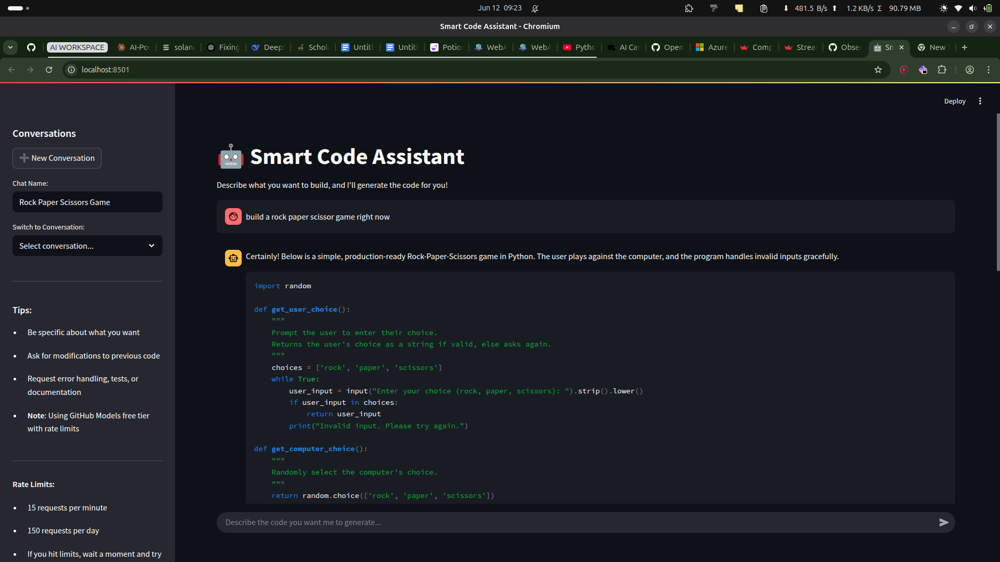

# 🤖 Smart Code Assistant

Smart Code Assistant is an intelligent, web-based coding assistant built with **Streamlit** and powered by **OpenAI's GitHub-hosted models (via Azure AI Inference)**. It allows developers to describe what they want to build in plain language and instantly receive **production-ready, well-commented Python code**.

## 🧠 Features

- ✨ Natural language to code generation
- 💬 Chat-style interface with conversation history
- 🧠 Remembers up to 8 previous messages for context-aware generation
- 📁 Save and load past conversations (auto-named based on the request)
- 🔁 Edit chat names inline and reload conversations anytime
- 🛠️ Uses Azure AI Inference via GitHub token integration
- 📉 Graceful error messages for rate limits, quotas, or API errors

## 📸 Screenshot

  
> _An interactive code generation chat assistant in action_

## 🚀 Getting Started

### 1. Clone the Repository

```bash
git clone https://github.com/josiah-praise/smart-code-assistant.git
cd smart-code-assistant
```

### 2. Create a Virtual Environment (optional but recommended)

```bash
python -m venv venv
source venv/bin/activate  # On Windows: venv\Scripts\activate
```

### 3. Install Dependencies

```bash
pip install -r requirements.txt
```

### 4. Setup .env File
Create a .env file in the project root and add the following:

```dotenv
GITHUB_TOKEN=your_github_personal_access_token
API_BASE_URL=https://models.inference.ai.azure.com
MODEL_NAME=gpt-4o
```


1. Run the App
```bash
streamlit run app.py
# The app will open in your browser at http://localhost:8501
```

⚠️ Rate Limits
This app uses OpenAI models via GitHub-hosted Azure Inference. You may encounter:

15 requests per minute

150 requests per day

If you hit these, just wait and try again later.

🛠 Tech Stack
Streamlit

OpenAI Python SDK

GitHub-hosted Azure Models

🧑‍💻 Developer Notes
Conversations are saved automatically in conversations/ with a unique ID

Each conversation is given a smart title based on the first request

Code is formatted, explained, and shown in blocks with syntax highlighting